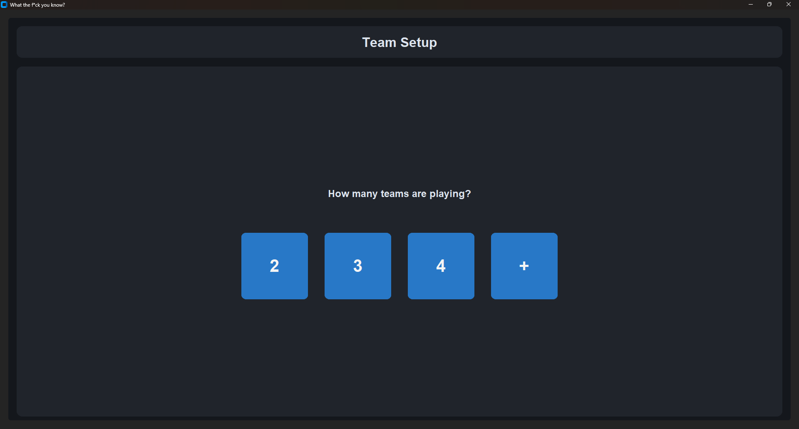
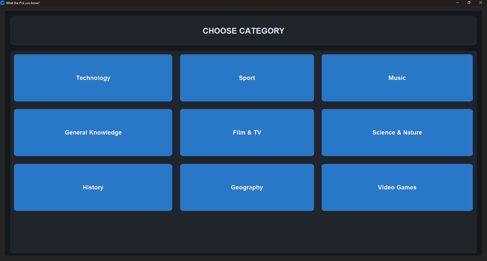
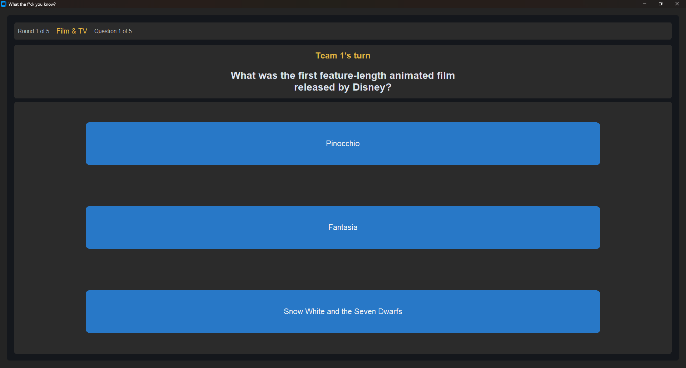
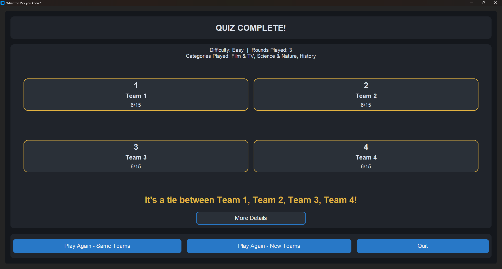
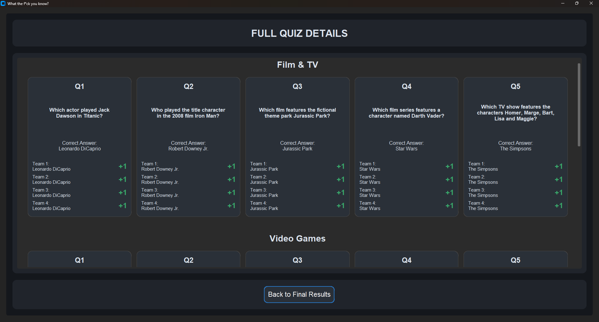

# What The F*ck You Know?

**Developer:** [Nick Bellamy](https://www.linkedin.com/in/nicholas-b-ab1b74184)

## Description

A desktop multiplayer trivia game built in Python using CustomTkinter.

The game is designed as a couch-style pub quiz where multiple teams compete across category-based rounds. Players can choose a difficulty, select categories, answer questions as teams, and compare scores at the end of each round and game.

## Main Features 

- Supports 2 to 12 teams
- Difficulty selection between Easy, Medium and Hard
- Category-based trivia rounds
- Randomised question selection from a bank of questions
- Randomised multiple-choice answers
- Individual round scoring
- Final game scoring
- Replay with same or new teams
- Scrollable results screens for larger games
- Fullscreen GUI
- Standalone Windows build using PyInstaller

## Requirements

- Python 3.13 (current development/test version)
- CustomTkinter

## Running the Game

### Running from source

Install CustomTkinter before running the game:

```bash
python.exe -m pip install customtkinter
```

Then run the game:

```bash
python.exe ui.py
```

### Standalone Windows Build

The packaged PyInstaller version does not require the user to install Python or CustomTkinter.

The standalone build has been successfully tested on a clean Windows installation.

## Project Status

The core game is complete and fully playable.

The standalone Windows build has been successfully tested on a clean Windows installation without Python or CustomTkinter installed.

Further development may include additional questions, categories, game modes, and UI improvements.

## Known Issues

UI elements may scale or align incorrectly when Windows display scaling is above 100%.

## Screenshots

### Team Setup


### Category Selection


### Gameplay


### Final Results


### Full Quiz Details


## Project Structure
- `ui.py` - CustomTkinter interface and screen management
- `game.py` - Main quiz and game logic
- `team.py` - Team data and scoring
- `question.py` - Question model
- `questionbank.py` - Loads and filters questions
- `data/` - JSON question bank

## License

This project is licensed under the MIT License. See the `LICENSE` file for details.